* Table of Contents
{:toc}

## **Setting up, getting started**

Refer to the guide [_Setting up and getting started_](SettingUp.md).

--------------------------------------------------------------------------------------------------------------------

## **Design**

### Architecture


The ***Architecture Diagram*** given above explains the high-level design of the App. Given below is a quick overview of each component.

**`Main`** has **two** classes called [`Main`](https://github.com/se-edu/addressbook-level3/tree/master/src/main/java/seedu/address/Main.java) and [`MainApp`](https://github.com/se-edu/addressbook-level3/tree/master/src/main/java/seedu/address/MainApp.java). It is responsible for,
* At app launch: Initializes the components in the correct sequence, and connects them up with each other.
* At shut down: Shuts down the components and invokes cleanup methods where necessary.

[**`Commons`**](#common-classes) represents a collection of classes used by multiple other components.

The rest of the App consists of four components.

* [**`UI`**](#ui-component): The UI of the App.
* [**`Logic`**](#logic-component): The command executor.
* [**`Model`**](#model-component): Holds the data of the App in memory.
* [**`Storage`**](#storage-component): Reads data from, and writes data to, the hard disk.

Each of the four components,

* defines its *API* in an `interface` with the same name as the Component.
* exposes its functionality using a concrete `{Component Name}Manager` class (which implements the corresponding API `interface` mentioned in the previous point.

For example, the `Logic` component (see the class diagram given below) defines its API in the `Logic.java` interface and exposes its functionality using the `LogicManager.java` class which implements the `Logic` interface.


**How the architecture components interact with each other**

The *Sequence Diagram* below shows how the components interact with each other for the scenario where the user issues the command `delete-p 1`.


The sections below give more details of each component.

### UI component
{ start of `ui` section written by: Kor Ming Soon }

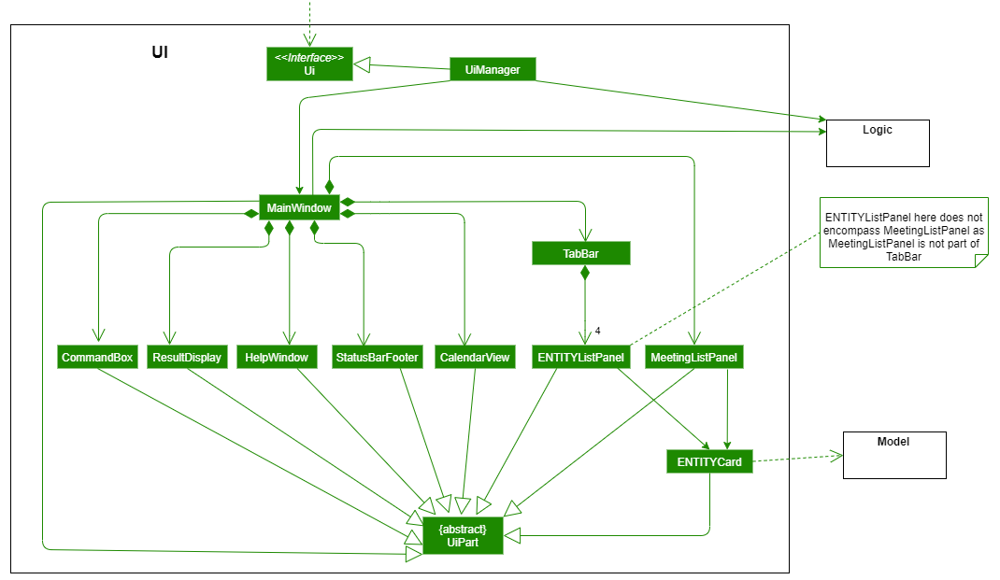

**API** :
[`Ui.java`](https://github.com/AY2021S1-CS2103-W14-1/tp/blob/master/src/main/java/seedu/address/ui/Ui.java)

The UI consists of two components:
- `MainWindow` 
- `HelpWindow`

---
#### [`MainWindow.java`](https://github.com/AY2021S1-CS2103-W14-1/tp/blob/master/src/main/java/seedu/address/ui/MainWindow.java)

`MainWindow` is made up of the following parts:
- [`ResultDisplay`](https://github.com/AY2021S1-CS2103-W14-1/tp/blob/master/src/main/java/seedu/address/ui/ResultDisplay.java)
- [`CommandBox`](https://github.com/AY2021S1-CS2103-W14-1/tp/blob/master/src/main/java/seedu/address/ui/CommandBox.java)
- [`TabBar`](https://github.com/AY2021S1-CS2103-W14-1/tp/blob/master/src/main/java/seedu/address/ui/TabBar.java)
- [`StatusBarFooter`](https://github.com/AY2021S1-CS2103-W14-1/tp/blob/master/src/main/java/seedu/address/ui/TabBar.java) 
- [`CalendarView`]((https://github.com/AY2021S1-CS2103-W14-1/tp/blob/master/src/main/java/seedu/address/ui/CalendarView.java))
- [`MeetingListPanel`](https://github.com/AY2021S1-CS2103-W14-1/tp/blob/master/src/main/java/seedu/address/ui/meeting/MeetingListPanel.java)

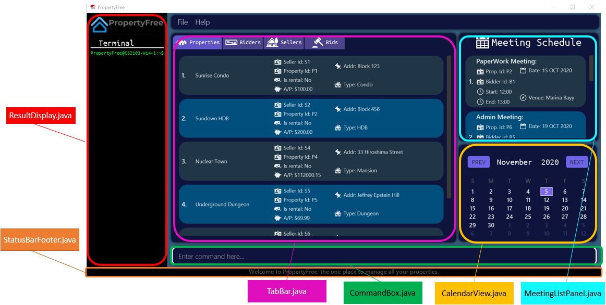
*Note that the font colour in the picture is only different for visibility purposes.*

After deliberation, we chose to proceed with TabBar as TabBar allowed
us to represent the details of our entities neatly. 
Each entity in Property belongs to a designated `ListPanel` (as shown below).

The `TabBar` component itself consists of the following parts:
- [`PropertyListPanel`](https://github.com/AY2021S1-CS2103-W14-1/tp/blob/master/src/main/java/seedu/address/ui/property/PropertyListPanel.java)
- [`BidderListPanel`](https://github.com/AY2021S1-CS2103-W14-1/tp/blob/master/src/main/java/seedu/address/ui/bidder/BidderListPanel.java)
- [`SellerListPanel`](https://github.com/AY2021S1-CS2103-W14-1/tp/blob/master/src/main/java/seedu/address/ui/seller/SellerListPanel.java)
- [`BidListPanel`](https://github.com/AY2021S1-CS2103-W14-1/tp/blob/master/src/main/java/seedu/address/ui/bid/BidListPanel.java)

Each panel will display the list of the entities corresponding to the name of the panel.

1. Alternative 1 (current choice): Choosing `TabBar` to represent information of our entities.
    - Pros: 
        - Neater segmentation of entities visually
        - Able to leverage on existing AB3 Ui implementation for representing `Person`
            
    - Cons:
        - Requires user to click to switch tab, not CLI-centric (tackled below)  
        
 2. Alternative 2: Maintain a single list on GUI and list only relevant entities based on certain actions such
 as commands.
    - Pros: 
        - Fewer changes to existing AB3 Ui implementation
    - Cons: 
        - Increases code complexity as a combined list has to be created and filter accordingly

The thought process behind the `Ui` was ultimately a choice between usability of the application
and complexity of implementation.

---
#### [`HelpWindow.java`](https://github.com/AY2021S1-CS2103-W14-1/tp/blob/master/src/main/java/seedu/address/ui/HelpWindow.java)

The `HelpWindow` is a pop up window that is activated upon clicking of the Help button in PropertyFree, or when the `help` command
is executed.

The `Copy URL` button would automatically copy the link of PropertyFree's User Guide into the user's clipboard.


---

All the above-mentioned components in `MainWindow` and `HelpWindow`, inherit from the abstract `UiPart` class.

The `UI` component uses JavaFx UI framework. The layout of these UI parts are defined in matching `.fxml` 
files that are in the `src/main/resources/view` folder. 
For example, the layout of the [`MainWindow`](https://github.com/AY2021S1-CS2103-W14-1/tp/blob/master/src/main/java/seedu/address/ui/MainWindow.java)
is specified in [`MainWindow.fxml`](https://github.com/AY2021S1-CS2103-W14-1/tp/blob/master/src/main/resources/view/MainWindow.fxml)

The `UI` component,

* Executes user commands using the `Logic` component.
* Listens for changes to `Model` data so that the UI can be updated with the modified data.
* Returns what to be printed out on the UI

{ end of `ui` section written by: Kor Ming Soon }

### Logic component


**API** :
[`Logic.java`](https://github.com/se-edu/addressbook-level3/tree/master/src/main/java/seedu/address/logic/Logic.java)

1. `Logic` uses the `AddressBookParser` class to parse the user command.
1. This results in a `Command` object which is executed by the `LogicManager`.
1. The command execution can affect the `Model` (e.g. adding a person).
1. The result of the command execution is encapsulated as a `CommandResult` object which is passed back to the `Ui`.
1. In addition, the `CommandResult` object can also instruct the `Ui` to perform certain actions, such as displaying help to the user.

Given below is the Sequence Diagram for interactions within the `Logic` component for the `execute("delete-m 1")` API call.


### Model component
{ start of Model Component section written by: Kor Ming Soon }

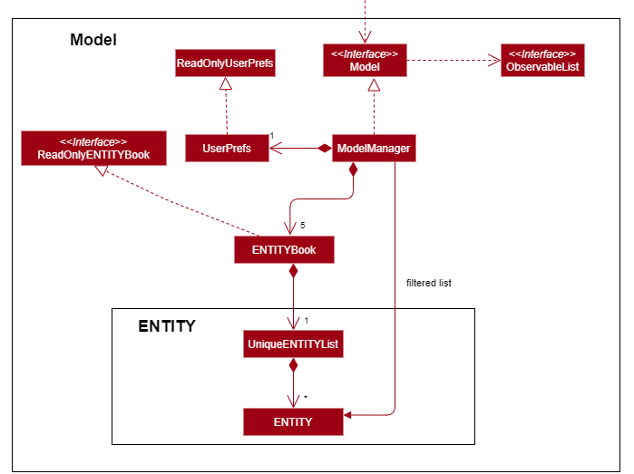

**API** : [`Model.java`](https://github.com/AY2021S1-CS2103-W14-1/tp/blob/master/src/main/java/seedu/address//model/Model.java)

<div markdown="span" class="alert alert-info">:information_source: Note that the usage of the term `ENTITY` represents any of the following entities in PropertyFree:<br>`Property`, `Seller`, `Bidder`, `Bid` and `Meeting`
</div>  

The `Model`,

* stores a `UserPref` object that represents the user’s preferences.

* does not depend on any of the other three components.

* stores the following `ENTITY` book data which consists of the following:
    - `PropertyBook`
    - `SellerAddressBook` 
    - `BidderAddressBook`
    - `MeetingBook`
    - `BidBook`
    
* exposes an unmodifiable `ObservableList<ENTITY>` that can be 'observed' by the UI component.

  *e.g. The UI is bounded to the 5 different lists so that 
  the UI automatically updates when the data in any of the lists are changed.*

The following segment of the `Model` components further breaks down each `ENTITY` for a more elaborate 
explanation of each entities' design.  
- Bidder and Seller
- Property
- Bid
- Meeting  

---
### Bidder and Seller 
The following class diagram depicts how the `Bidder` and `Seller` are created. The `Bidder` and `Seller` both extend from the
abstract `ClientPerson` which in turn extends from abstract `Person`.  

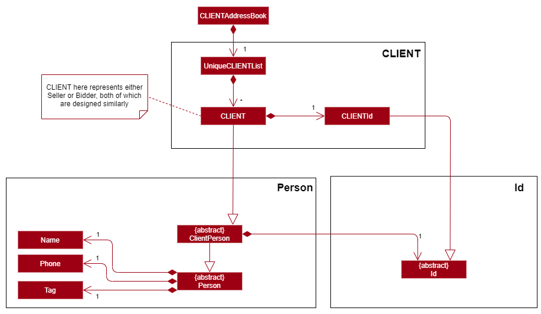

Note that the `CLIENTId` (BidderId / SellerId) design is elaborated in `Id` in [the following segment](#ID).

#### Design Considerations

 1. Alternative 1 (current choice): Extending `Bidder` and `Seller` from `ClientPerson`, and `ClientPerson` from `Person`  
    - Pros: 
        - Neater segmentation of entities
        - Easier extensibility for additional entities who require an `Id`
        in the future if necessary (e.g Person representing an organization or company)
    - Cons: 
        - Increased code complexity

 2. Alternative 2: Extending `Bidder` and `Seller` directly from `Person`
    - Pros: 
        - Sufficient and possible coverage for current requirements of PropertyFree
        - Lesser code complexity
        - Lesser changes to AB3 code base
    - Cons: 
        - Lesser extensibility and increased possibility of coupling if more entities are introduced
        
 3. Alternative 3 (current choice): Changing `Tag` from `Set<Tag>` in original AB3 implementation
    - Pros: 
        - Lesser code complexity and fewer testing required for extension  
        - Better suited for PropertyFree's purpose as a client management system where the purpose of the client is already 
        well specified without need for `Set<Tag>`
        - Improved UI by having `Tag` acting as a form of visual identifier, instead of complete removal of `Tag`
    - Cons: 
        - Refactoring from original AB3 implementation required substantial time
        
> *`Tag` was kept in `Person` instead of `ClientPerson` to reduce refactoring required from AB3.*

{ End of Model Component section written by: Kor Ming Soon }
       
#### ID

{ Start of Id Model section written by: Dianne Loh and Kor Ming Soon }

The follow class diagram depicts the design behind `Id` and the subclasses: `SellerId`, `BidderId` and `PropertyId`.

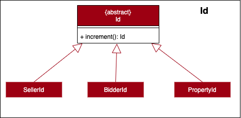

{ End of Id Model section written by: Dianne Loh and Kor Ming Soon }

--- 

### Property 

{ Start of Property Model Component section written by: Dianne Loh }

The following class diagram depicts `Property` and its related classes.  

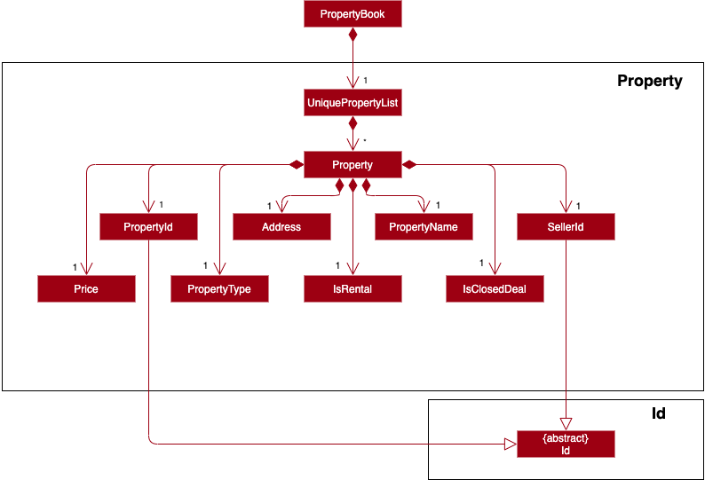

#### Design Considerations

The implementations of `PropertyType` and `Address` are similar as they both are wrapper classes of a String. This implementation is justified because of the following considerations:

1. Alternative 1 (current choice): Implementing `PropertyType` and `Address` as separate classes.
    - Pros:
        - Better adherence to the separations of concerns principle by separating code related to `PropertyType` and `Address`
        - Easier extensibility for the classes to contain more specific attributes. For example, `Address` can be extended to contain more specific attributes, such as road name, block and postal code, etc.  
    - Cons: 
        - More code duplication (for now)
2. Alternative 2: `PropertyType` and `Address` extends from a parent class.  
    - Pros:
        - Less code duplication (for now) 
    - Cons:
        - Less extensible 
        - Modifying the behaviour of one type will affect the other 
        
{ End of Property Model Component section written by: Dianne Loh }

### Bid 

{ start of Bid Model Component section written by: Marcus Duigan Xing Yu }

The following class diagram depicts how a `Bid` is created.

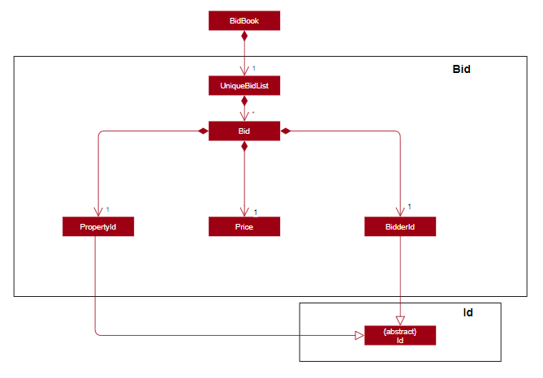

##### Design Considerations

 1. Alternative 1 (current choice): Do not give bids its own Bid Id.
    - Pros: 
        - A bid is already unique as it cannot have the same property id and bidder id for two separate
          bids. Thus having a unique bid Id over complicates the bid for no reason
    - Cons: 
        - The user must know the bidder Id and property Id to find the exact bid instead of using a bid Id

 2. Alternative 2: Give a specific Id to the bids.
    - Pros: 
        - Can track how many bids have been made
        - Easier for users to execute certain commands aka delete-bid
    - Cons: 
        - More complicated
        - Having a bid Id does not help other entities 
        
 3. Alternative 3: Create a bid specific to a property and have a list of bidders as a parameter.
    - Pros: 
        - Associates all bidder Id's to a specific property
        - Easier to track if there is a duplicate bidder for a certain bid
    - Cons: 
        - Difficult to edit specific bids in terms of parameters
        - Difficult to find all bids related to a specific bidder

{ end of Bid Model Component section written by: Marcus Duigan Xing Yu }

### Meeting 

{ start of Meeting Model Component section written by: Harsha Vardhan  }

The following class diagram depicts how the different types of meetings are being created. The `Admin`, `Paperwork` and `Viewing` meeting types extend from the
abstract `Meeting`.  


As seen from the diagram above there are three subtypes of Meetings: Admin, Paperwork and viewing. Each of the meeting
types then contain the attributes of `BidderId`, `PropertyId`, `Venue`, `MeetingDate`, `StartTime` and `EndTime`.

##### Design Considerations

 1. Alternative 1 (current choice): Extending `Admin`, `Paperwork` and `Viewing` from  an abstract `Meeting`
    - Pros: 
        - Neater segmentation of the different meeting types
        - Easier extensibility for additional other types of meeting in the future
    - Cons: 
        - Increased code complexity

 2. Alternative 2: Identifying the different meeting types through a flag that stores the type of the meeting as a string
    - Pros: 
        - Minimal code will be required as the same class can be used to instantiate the different meetings
        - Lesser code complexity
        - Less repetition of code
    - Cons: 
        - Less extensibility because it is difficult to include new methods for a specific type 
        
{ End of Meeting Model Component section written by: Harsha Vardhan  }

### Storage component
{ Start of Storage Component section written by: Harsha Vardhan  }

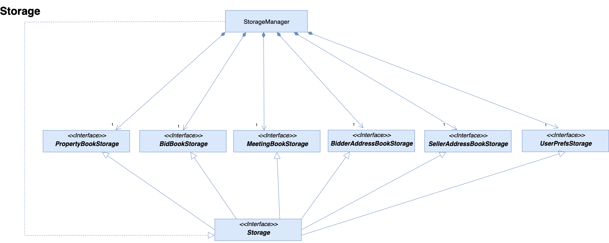  

**API** : [`Storage.java`](https://github.com/AY2021S1-CS2103-W14-1/tp/blob/master/src/main/java/seedu/address/storage/Storage.java)  

The `Storage` component,
* implements all the the different storage types as shown in the diagram above.
* can save `UserPref` objects in json format and read it back.
* can save the various storage books we have in json format and read it back.


The above shows the further implementations of each individual storage component.
For the storage components,
* the implementations across the different types of storage is similar.
* the different JsonENTITYBookStorage is responsible for saving the datas in json format. For example, 
let's take a look at PropertyBookStorage. The JsonPropertyBookStorage will store all the data that is 
associated with property in the file in json format. In the JsonAdaptedProperty, there will be all the attributes
that are associated with property that will eventually be stored in json format. The other storage books do follow 
a similar implementation.

#### Design Consideration
   
   1. Alternative 1 (current choice): Have different storage for the different entities.
        - Pros: Easier to implement and do not require refactoring for the existing code base. The code can be reused 
        and extended easily for the various entities. It will be easier to debug and find mistakes as when something goes wrong with a 
        particular entity it will be easier to know which entity is affected.
        - Cons: There will be a lot of files with repetitive code. 
        
   2. Alternative 2: Use the current AddressBookStorage and modify it to contain the different entities.
        - Pros: Everything will be in one single folder and it will be easier to access the code. There will not be multiple repeats of the same code
        across the different files. 
        - Cons: The code file might become huge and might become difficult to debug when there is an error.

{ End of Storage Component section written by: Harsha Vardhan  }


### Common classes

Classes used by multiple components are in the `seedu.addressbook.commons` package.

--------------------------------------------------------------------------------------------------------------------

## **Implementation**

This section describes noteworthy details on how certain features are implemented. The details of the features are
categorized accordingly to the features: 
1. `Add`
2. `Edit`
3. `Find`
4. `Sort`
5. `Delete`
6. `List`

Additional features apart from the above-mentioned feature includes:
- Automated change of `TabBar` and `ENTITYListPanel` with corresponding ENTITY command
- `next` and `prev` command for Calendar UI Navigation
- Key-press for UI navigation

#### 1. Add
{ start of Add section written by: Marcus Duigan Xing Yu}

The `Add` command applies to **all entities** in PropertyFree. Apart from `AddBidCommand`, `AddMeetingCommand` and `AddPropertyCommand` with slight differences in implementation (elaborated below), all other entities follow the same
implementation.

1. When the `Add` command is executed by the user, the input it passed into
the `LogicManager` and thereafter parsed and identified in `AddressBookParser`. 

2. Upon identifying the relevant `COMMAND_WORD` and by extension the `ENTITY` (through the `-` input)
, the corresponding `AddENTITYCommandParser` object is formed. The user input then goes
through another level of parsing in `AddENTITYCommandParser`.

3. The `AddENTITYCommandParser` identifies the parameters corresponding to the user's input, and a new `AddENTITYCommand`
object is formed taking in the identified parameters. 
The `AddENTITYCommand` is then encapsulated under `Command` and passed back into the `LogicManager`.

4. The `AddENTITYCommand` calls `execute(model)`. The execution of the command then interacts
with the `Model` component, and retrieves the unmodifiable view of `ObservableList<ENTITY>`.

5. The `Model` accesses the relevant ENTITYBook and adds the object to the ENTITYBook. The `Ui` then "listens" to the 
changes in the ENTITYBook and updates the GUI.

6. Finally, `AddENTITYCommand` is then encapsulated as a `CommandResult` and passed into the `LogicManager`.

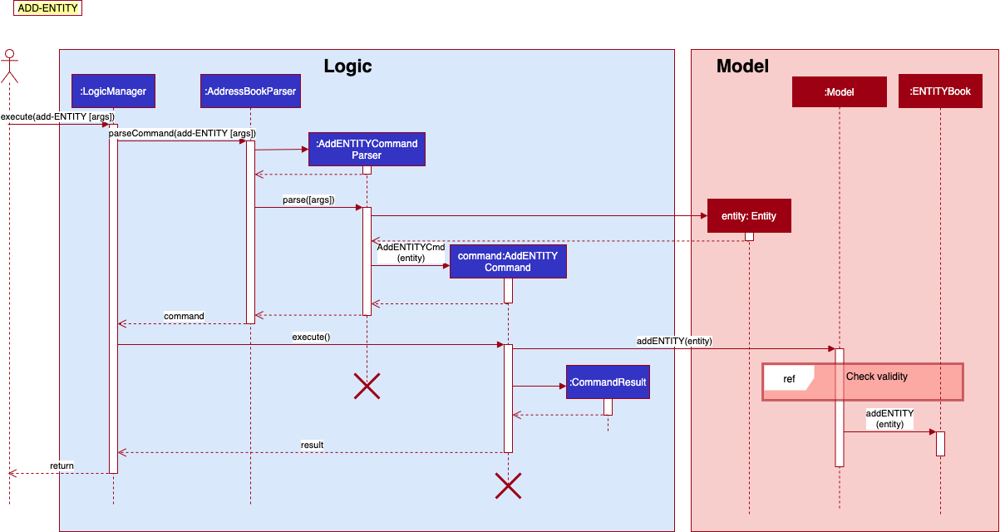

##### 1.1 Add Bid Command


7. For Add-bid Command and Add-Meeting Command they have an additional step of checking whether the user inputs for bidder Id and property Id are valid before 
adding to the Bidbook or MeetingBook as seen in the diagram above.  

8. For add-bid command, it also contains an auto-sort feature where it will call a sort-bid method which ensures the list is always sorted
by property Id followed by Bid Amount. For further clarification, refer to section 4. Sort for a more in depth description.

{ End of Add section written by: Marcus Duigan Xing Yu}


##### 1.2 Add Property Command  

{ start of Add Property section written by: Dianne Loh }

The implementation of the Add Property feature includes an additional validity check to ensure that the seller id exists. Below is the sequence diagram for the `check validity` frame:  

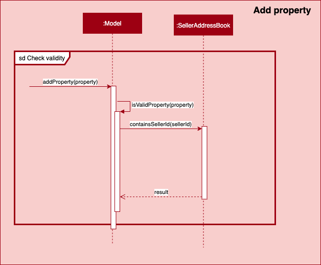

If the check returns false, an `InvalidSellerIdException` is thrown.  

<div markdown="span" class="alert alert-primary">:information_source: Upon adding a property into the `UniquePropertyList`, the `PropertyId` of each property is automatically incremented according to the activity diagram below:
</div>  

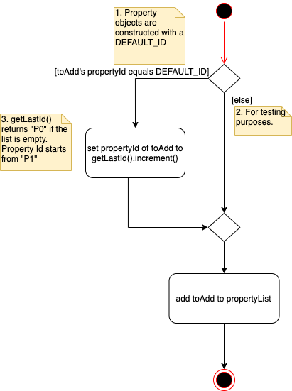

{ End of Add Property section written by: Dianne Loh }

#### 2. Edit
{ start of Edit section written by: Christopher Mervyn}

The `Edit` command applies to **all entities** in PropertyFree.

1. When the `Edit` command is executed by the user, the input is passed into
the `LogicManager` and thereafter parsed and identified in `AddressBookParser`. 

2. Upon identifying the relevant `COMMAND_WORD` and by extension the `ENTITY` (through the `-` input)
, the corresponding `EditENTITYCommandParser` object is formed. The user input then goes
through another level of parsing in `EditENTITYCommandParser`.

3. The `EditENTITYCommandParser` identifies the parameters corresponding to the user's input, and a new `EditENTITYDescriptor` object is formed with the corresponding `setENTITY` method to be called.
The `EditENTITYDescriptor` will set the parameter as accordance with the user input. 
and  `EditENTITYCommand`

4. After which, the `EditENTITYCommandParser` will create  a new `EditENTITYCommand` object from the result of the corresponding `setENTITY` method. The `EditENTITYCommand` is then encapsulated under `Command` and passed back into the `LogicManager`.

5. The `EditENTITYCommand` calls `execute(model)`. The execution of the command then interacts
with the `Model` component, and retrieves the unmodifiable view of `ObservableList<ENTITY>`.

6. The `Model` accesses the relevant `ENTITYBook` and adds the object to the `ENTITYBook`. The `Ui` then "listens" to the 
changes in the `ENTITYBook` and updates the GUI.

7. Finally, `EditENTITYCommand` is then encapsulated as a `CommandResult` and passed into the `LogicManager`.

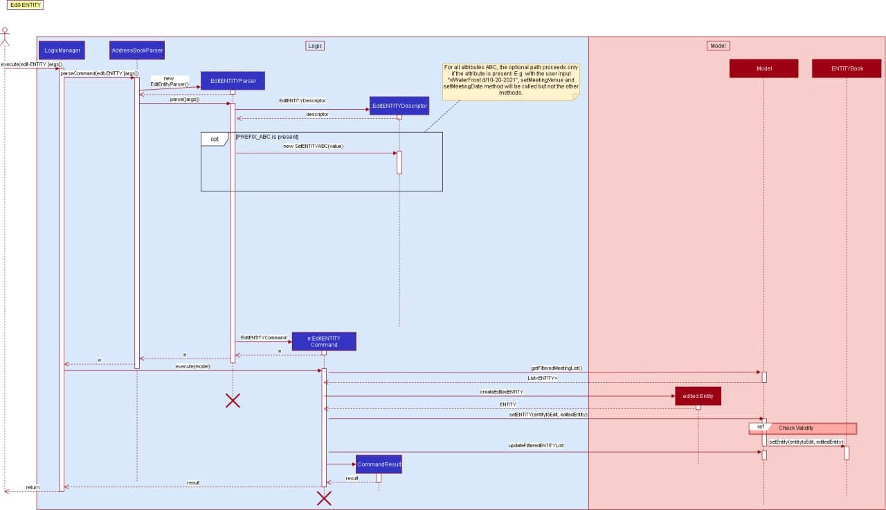


##### 2.1 Edit Entity Validity Check

Below is an example of how a meeting object to be edited will ensure that a valid property Id and bidder Id are supplied by the user, this is similar to the add command validity check from above:


The property Id and bidder Id are checked in their respective unique books as seen before adding the new edited meeting to the meeting book.  

Edit Bid Command and Edit Property Command will also do the validity check as described in its [Add ENTITY section](#1-add).

{ End of Edit section written by: Christopher Mervyn}


#### 3. Find  

{ Start of Find section written by: Dianne Loh }  

The `Find` command applies to **all entities** in PropertyFree. There are two implementations of `Find`:  
1. One-Predicate Implementation (for `Bid`, `Bidder` and `Seller`)
2. Multi-Predicate Implementation (for `Property` and `Meeting`)  

##### 3.1 One-Predicate Implementation of `FindENTITYCommand` (for `Bid`, `Bidder` and `Seller` only)  
1. When the `Find` command is executed by the user, the input is passed into `LogicManager` and then parsed in `AddressBookParser`.  
2. Upon identifying the `COMMAND_WORD` `Find` and the entity from the input `find-ENTITY`, the relevant `FindENTITYCommandParser` is created.  
3. The `FindENTITYCommandParser` parses the arguments into an `ABCContainsKeywordsPredicate`, where `ABC` represents an attribute, creates a `FindENTITYCommand` with the predicate and returns the command to the `LogicManager`.    
4. The method `execute(model)` of `FindENTITYCommand` is called, which updates the `filteredENTITY` list in `ModelManager` by setting the predicate.  
5. The GUI "listens" to the changes in the filtered list and updates its display.  
7. Finally, a `CommandResult` is returned to `LogicManager` to display the feedback to the user.  

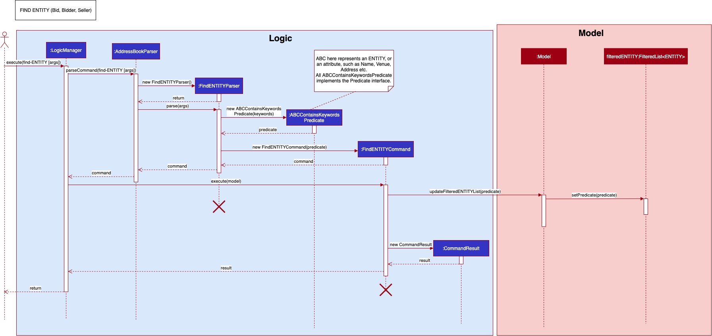

##### 3.2 Multi-Predicate Implementation of `FindENTITYCommand` (for `Property` and `Meeting` only)  
This implementation differs from the One-Predicate implementation only in steps 3 and 4:  

**Step 3**: The `FindENTITYCommandParser` creates a `FindENTITYDescriptor`.  For each prefix (eg `n/...`) in the input, the `FindENTITYCommandParser` parses the arguments into the relevant `ABCContainsKeywordsPredicate` and sets the `ABCContainsKeywordsPredicate` of the `FindENTITYDescriptor`. The `FindENTITYCommandParser` then creates a `FindENTITYCommand` with the `FindENTITYDescriptor`, which is returned to `LogicManager`.  
**Step 4**: `execute(model)` of `FindENTITYCommand` gets the composed predicate from `FindENTITYDescriptor` and passes the predicate to `ModelManager` to update the `FilteredENTITY` list.  

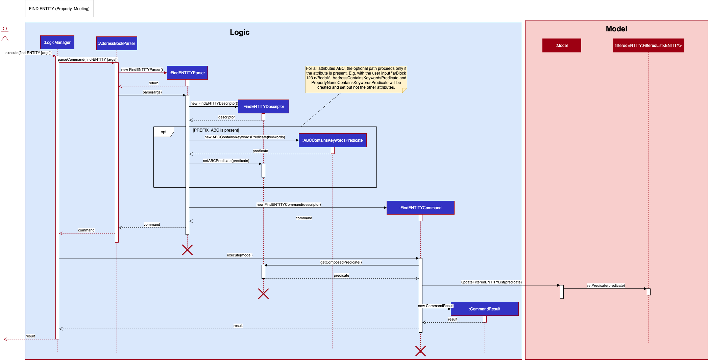  

<div markdown="span" class="alert alert-primary">:bulb: `AskingPricePredicate` is a special type of `Predicate` that tests if a `Property`'s `askingPrice` passes the `PriceFilter`, whose class diagram is as follows:
</div>  

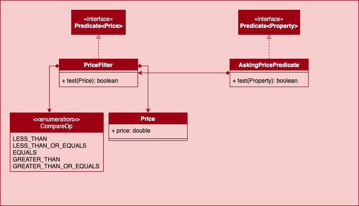  

{ End of Find section written by: Dianne Loh }

#### 4. Sort 
{ Start of Sort section written by: Harsha Vardhan}  

The `Sort` command applies to **Meeting** and **Bids** in PropertyFree. Both `SortMeetingCommand` and the `SortBidCommand`
follow similar implementations with slight differences. The `SortBidCommand` is slightly different as it has an auto-sort
feature when bids are added or edited. Below we will look into the implementation of the `SortMeetingCommand`.

The sort meeting feature sorts the meetings based on the different dates of the meetings from the earliest meeting
to the last meeting in chronological order.
1. When the `sort-m` command is executed by the user, the input it passed into
   the `LogicManager` and gets parsed and identified in `AddressBookParser`. 
2. Upon identifying the relevant `COMMAND_WORD` and by extension the `ENTITY` (through the `-` input)
   , the corresponding `SortMeetingCommandParser` object is formed. The user input then goes
   through another level of parsing in `SortMeetingCommandParser`
3. The `SortMeetingCommandParser` identifies the order in which the meetings are to be sort and creates a 
 `SortMeetingComparator` comparator object accordingly.
4. The ```SortMeetingCommandParser``` creates a ```SortMeetingCommand``` with the above comparator. The command
is returned to the ```LogicManager```.
5. The ```LogicManager``` calls ```SortMeetingCommand#execute()```, which adds a new duplicate list of meetings that is
 sorted in chronological order in ```MeetingBook``` via the ```Model``` interface.
6. Finally, a ```CommandResult``` with the relevant feedback is returned to the ```LogicManager```.

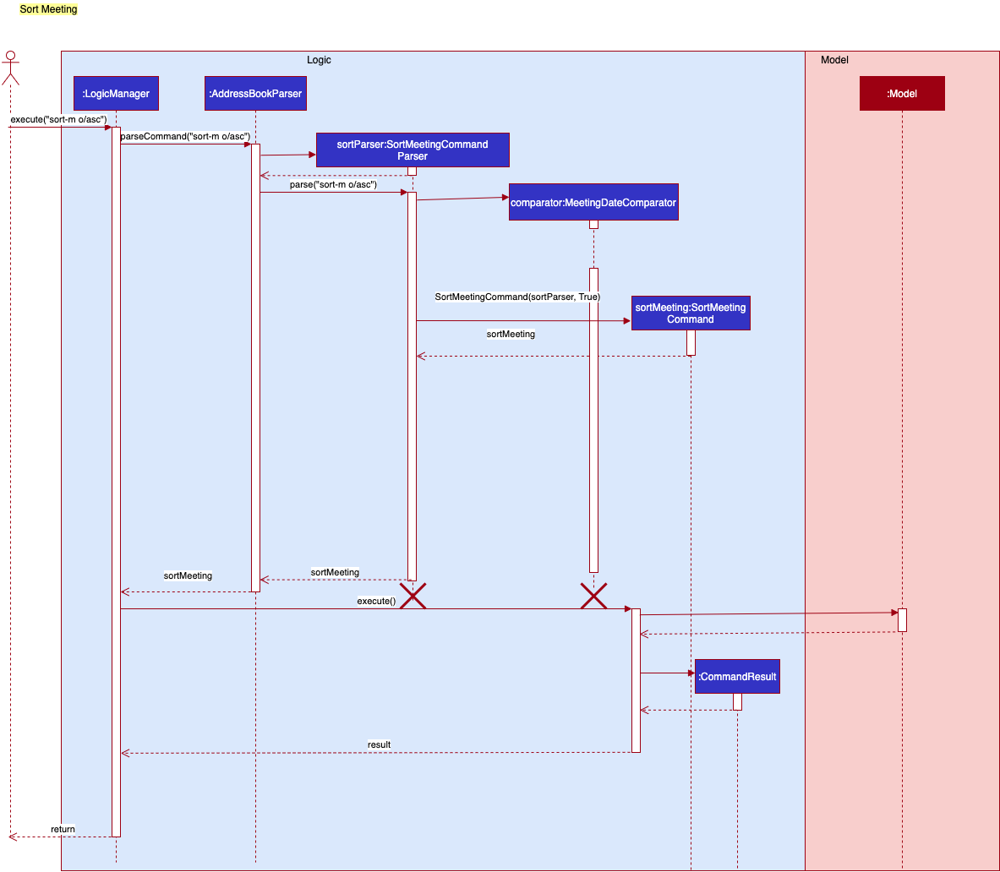


##### Design Considerations
 For the `SortMeetingCommand`, we had several considerations that we made on whether to sort the list manually through
 the `sort-m` command or to automatically sort the list for every meeting that is added or edited.
  
 1. Alternative 1 (current choice): User has the option to sort the list manually in both ascending and descending format.
 The meeting list will not be automatically sorted when a meeting has been added or changed. 
 
    - Pros: 
        - If the user types in wrong information for a certain meeting, he is able to see the meeting at the bottom rather 
        than filtering through a sorted list which makes it easier to fix the error that he has made.
        - Code will be easier to implement as we so not need to implement the auto sort phase.
        
    - Cons: 
        - User has to manually sort the list, using the `sort-m` command, after keying in the new meetings to obtain an
        ordered meeting list.
        
 2. Alternative 2: The meeting list will be automatically sorted every time the user makes a new meeting or edits one.
   
      - Pros: 
          - Meetings will always be in chronological order and user does not have to key in any command to sort the list.
          
      - Cons: 
          - If the user adds in a meeting with wrong details to a huge list of meetings, it will be difficult to find the meeting.
          If the previous method was used the new meting added will be at the bottom of the list. 
          - The code will be much more complex compared to alternative 1.
          - User will not be have the ability to sort the list in different orders. 


{ end of Sort section written by: Harsha Vardhan}

##### 4.1 Auto-Sort Feature for add-bid and edit-bid
{ start of Add/Edit auto-sort feature section written by: Marcus Duigan Xing Yu}

During the execution of `add-bid` and `edit-bid` command in the model manager, it executes a sort function similar to the above diagram's execution stage. The method names that are 
called instead are `updateSortedBidList(bidComparator)` which is called after the `addBid/updateFilteredBidList` method is called.

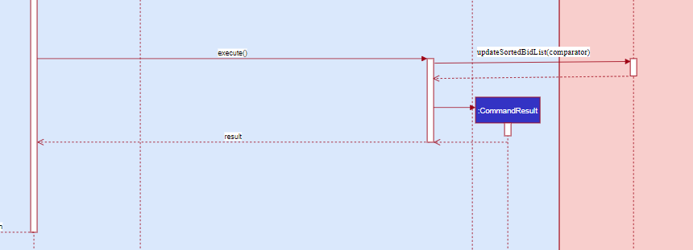

{ end of Add/Edit auto-sort feature section written by: Marcus Duigan Xing Yu}
#### 5. Delete
{ start of Delete section written by: Kor Ming Soon }

The `Delete` command applies to **all entities** in PropertyFree. Apart from `DeletePropertyCommand`, `DeleteBidderCommand`
and `DeleteSellerCommand` with slight differences in implementation (elaborated below), all other entities follow the same
implementation.

1. When the `Delete` command is executed by the user, the input it passed into
the `LogicManager` and thereafter parsed and identified in `AddressBookParser`. 

2. Upon identifying the relevant `COMMAND_WORD` and by extension the `ENTITY` (through the `-` input)
, the corresponding `DeleteENTITYCommandParser` object is formed. The user input then goes
through another level of parsing in `DeleteENTITYCommandParser`.

3. The `DeleteENTITYCommandParser` identifies the `Index` corresponding to the user's input, and a new `DeleteENTITYCommand`
object is formed taking in the identified `Index`. 
The `DeleteENTITYCommand` is then encapsulated under `Command` and passed back into the `LogicManager`.

4. The `DeleteENTITYCommand` calls `execute(model)`. The execution of the command then interacts
with the `Model` component, and retrieves the unmodifiable view of `ObservableList<ENTITY>`.

5. The `DeleteEntityCommand` retrieves the corresponding `ENTITY` to the `Index` (as received in 3), and calls on the
`deleteENTITY(ENTITYToDelete)` method of the `Model`.

6. The `Model` accesses the relevant ENTITYBook and removes the `ENTITYToDelete`. The `Ui` then "listens" to the 
changes in the ENTITYBook and updates the GUI.

7. Finally, `DeleteENTITYCommand` is then encapsulated as a `CommandResult` and passed into the `LogicManager`.

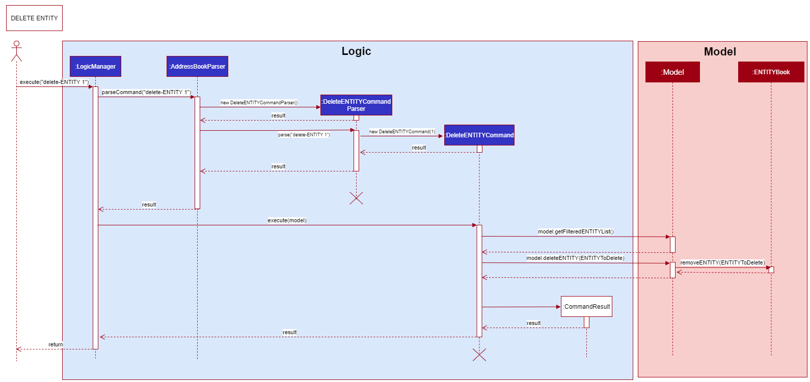

##### 5.1 Delete Bidder Command

<div markdown="span" class="alert alert-primary">The `Logic` portion of the sequence diagram shown subsequently is truncated to give more focus on the `Model` as the `Logic` implementation is similar to the above-mentioned. </div>  

The `DeleteBidderCommand` deletes the `bidderToDelete` corresponding to to the index given in the user input.
The command varies as other entities tied to the `bidderToDelete` by the `Id` will be deleted as well, namely:
`Bid` and `Meeting`.

1. Upon retrieving the `bidderToDelete`, the `bidderToDelete`'s `bidderId` is then retrieved and passed into
`removeAllBidsWithBidderId(bidderId)`. 

2. `BidBook` in turn calls `removeAllWithBidder(bidderId)` to iterate and delete through the list of bids 
containing the attribute of`bidderId`.

3. Step 1 and Step 2 are repeated but with `removeAllMeetingsWithBidderId(bidderId)` and `MeetingBook`.

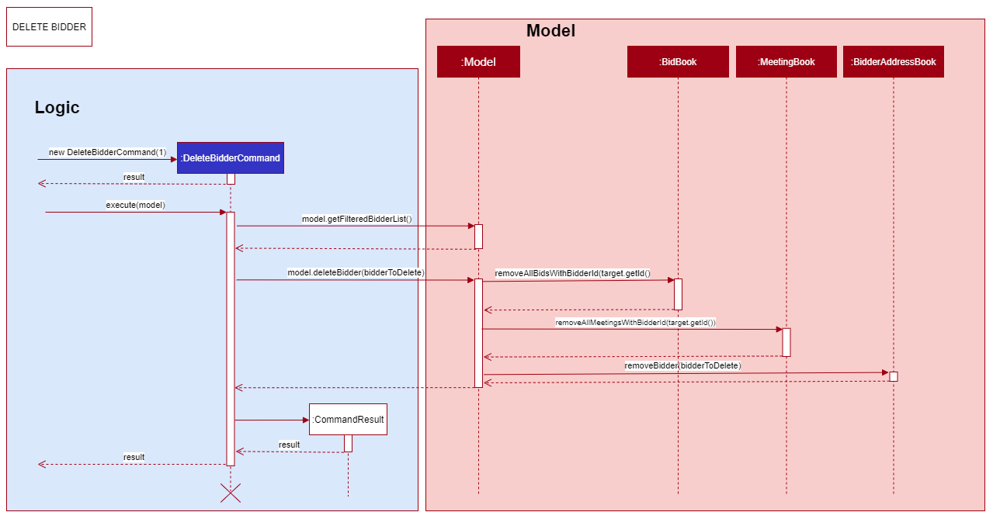

##### 5.2 Delete Seller Command

The `DeleteSellerCommand` deletes the `SellertoBeDeleted` corresponding to to the index given in the user input.
The command varies as other entities tied to the `sellerToDelete` by the `Id` will be deleted as well, namely:
`Property`. The deletion of the `Property` will in turn delete other entities (elaborated in 5.3).

1. Upon retrieving the `sellerToDelete`, the `sellerToDelete`'s `sellerId` is then retrieved and passed into
`removeAllBidsWithSellerId(sellerId)`. 

2. `PropertyBook` in turn calls `removeAllWithBidder(bidderId)` to iterate and delete through the list of properties 
containing the attribute of`sellerId`.

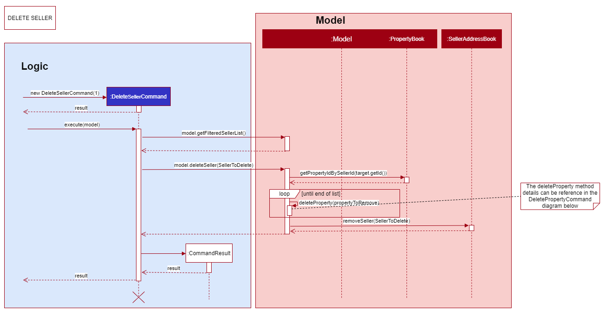

##### Design Considerations
 
  Due to time constraint we decided to forgo certain attributes and features which would have distinctly separated `Bidder`
  and `Seller` better (such as winning `bidder`). The implementation was designed with future extensions in mind. 
  This consideration applies to all `Commands` pertaining to `Bidder` and `Seller`, not just `Delete`.
  
 1. Alternative 1 (current choice): Having `DeleteBidderCommand` and `DeleteSellerCommand` extends from `Command` rather than
 a common command such as `DeleteClientCommand`. 
 
    - Pros: 
        - Less coupling if an extension is required in the future
        - Less refactoring was required from original implementation of AB3
        
    - Cons: 
        - Unable to exploit polymorphism even though both `Bidder` and `Seller` have a degree of similarity between both
        - Increases code complexity in `AddressBookParser`
        
{ End of Delete section written by: Kor Ming Soon }

##### 5.3 Delete Property Command  

{ Start of Delete Property section written by: Dianne Loh }  

The `DeletePropertyCommand` can delete a property by either the index or property id. The `DeletePropertyCommandParser` will parse the user input into either an `Index` or `PropertyId` and create the `DeletePropertyCommand`. If the user is deleting the property by index, then `targetId` will be `null` and vice versa. The sequence diagram is shown below, starting from the creation of `DeletePropertyCommand`.  

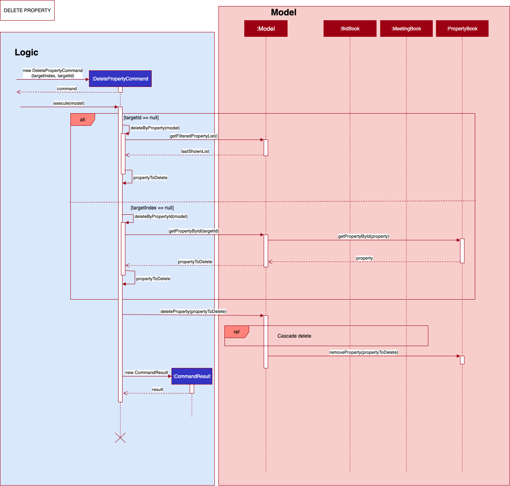

Upon deleting the property, all `Bid`s and `Meeting`s with the same `PropertyId` as the property being deleted will be deleted as well, as seen in the `Cascade delete` sequence diagram below:  

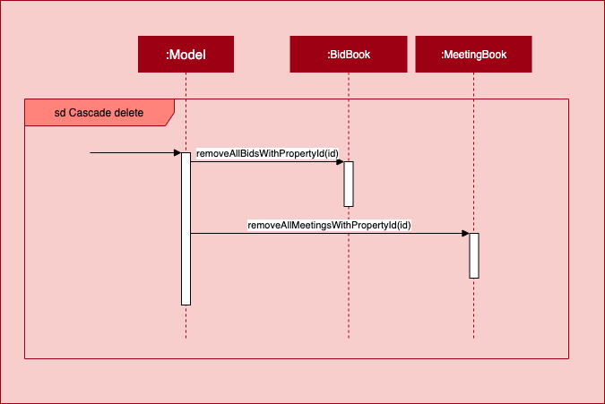

{ End of Delete Property section written by: Dianne Loh }  

#### 6. List

{ Start of List section written by: Marcus Duigan Xing Yu }

The `List` command applies to **all entities** in PropertyFree. All entities follow the same
implementation.

1. When the `List` command is executed by the user, the input it passed into
the `LogicManager` and thereafter parsed and identified in `AddressBookParser`. 

2. Upon identifying the relevant `COMMAND_WORD` and by extension the `ENTITY` (through the `-` input)
, the corresponding `ListENTITYCommand` object is formed.

4. The `ListENTITYCommand` calls `execute(model)`. The execution of the command then interacts
with the `Model` component, and retrieves the unmodifiable view of `ObservableList<ENTITY>`.

5. The `ListEntityCommand` then calls on the
`updateFilteredENTITYLIST` method of the `Model` and applies the filter predicate of PREDICATE_SHOW_ALL_ENTITY.

                                                
6. The `Model` accesses the relevant ENTITYBook and displays the entire list in the ENTITYBook. The `Ui` then "listens" to the 
changes in the display for the ENTITYBook and updates the GUI.

7. Finally, `ListENTITYCommand` is then encapsulated as a `CommandResult` and passed into the `LogicManager`.

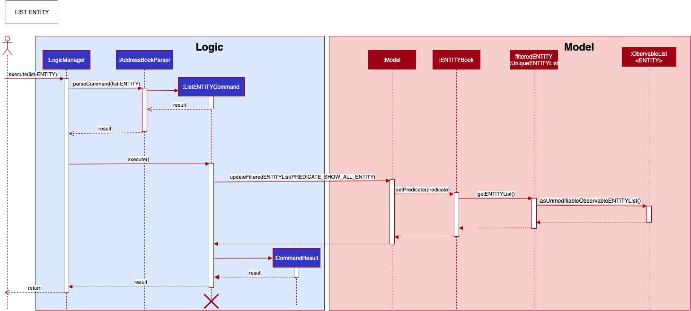

{ End of List section written by: Marcus Duigan Xing Yu }

### UI Navigation Implementation
{ Start of Ui implementation section written by: Kor Ming Soon }

This section explains the `Ui` implementation in PropertyFree. 

The implementation of `Ui` was implemented keeping in mind the constraint that the 
target user is more inclined towards command line interface. 

#### 1. Automated `TabBar` Switching based on Command

Given that PropertyFree deals with a variety of different entities. The challenge was identifying the corresponding
action and representing the right entity on the GUI.

The implemented is done as such:

- Creation of an `EntityType` (Enumeration) containing the following:  `BIDDER`, `SELLER`, `BID`, `PROPERTY` and `MEETING`. 

- `CommandResult` is given another attribute of `EntityType`, and a `setEntity(EntityType)` method is created. The method is
then called during the creation of the `CommandResult` object at each command.

- The `CommandResult` then passes the `EntityType` in `MainWindow` to set the `TabBar` accordingly to the entity relevant to 
command executed by the user.

The following activity diagram depicts the user journey and how the GUI responds accordingly in different scenarios.


#### 2. Key-press UI Navigation

<div markdown="span" class="alert alert-primary">The term `focus` refers to the component of which the user is able to interact with at any given moment.</div>  

Upon launch, the PropertyFree will set the focus in the `CommandBox`'s text field. 
This section highlights three simple key-press `Ui` navigation feature.

- Navigating to next month in CalendarView: `CONTROL`
- Navigating to previous month in CalendarView: `ALT / OPTIONS (Mac OS)`
- Navigating to `CommandBox`'s text field (when not in focus): `ENTER`

The key-press navigation is implemented in `MainWindow` where the method `handleFocusRequestWhenKeyPressed(CommandBox)` 
configures the `primaryStage` with an `addEventFilter()` to "listen" to the event when a key is pressed.

This in turns calls the method `handle(KeyEvent)` that runs and determine which key is pressed.
Thereafter executes one of the three possible navigation.


#### 3. Calendar Navigation Command

Calendar Navigation Command serves to provide an alternative for users to view the `CalendarView` if the user's keyboard
layout does not provide convenience for `ALT / OPTION` or `CONTROL`.

Two commands are created to handle the user input:

- `NextCalendarNavigationCommand`
- `PrevCalendarNavigationCommand`

The implementation of the two above-mentioned commands are largely similar to the `ListENTITYCommand`. 

However, apart from passing the `MESSAGE_SUCCESS` to `ResultDisplay`, the `CommandResult` checks `isCalendarNavigation()`
and calls the `handleToNext()` or `handleToPrev()` method in `CalendarView` depending on the user command input.

 
{ End of Ui implementation section written by: Kor Ming Soon }

--------------------------------------------------------------------------------------------------------------------

## **Documentation, logging, testing, configuration, dev-ops**

* [Documentation guide](Documentation.md)
* [Testing guide](Testing.md)
* [Logging guide](Logging.md)
* [Configuration guide](Configuration.md)
* [DevOps guide](DevOps.md)

--------------------------------------------------------------------------------------------------------------------

## Appendix A: Product scope

**Target user profile**:

* Has a need to manage a significant number of property details, seller details and buyer details
* Prefer desktop apps over other types
* Can type fast
* Prefers typing to mouse interactions
* is reasonably comfortable using CLI apps

**Value proposition**: Able to manage property listings, client 
contact details as well as creating a meeting schedule easily 
while being faster and more convenient than traditional bookkeeping 
softwares such as Excel. 


## Appendix B: User stories

Priorities: High (must have) - `* * *`, Medium (nice to have) - `* *`, Low (unlikely to have) - `*`

| Priority | As a …​                                    | I want to …​                                                           | So that I can…​                                                         |
| -------- | ----------------------------------------- | --------------------------------------------------------------------- | ---------------------------------------------------------------------- |
| `* * *`  | Real estate agent           | add a new property listing                                                          | add a new property entry when a seller wants to sell a new property    |
| `* * *`  | Real estate agent           | add bidder or seller                                                                | keep track of bidders or sellers involved                              |
| `* * *`  | Real estate agent           | view the list of interested sellers                                                 | keep track of property owners                                          |
| `* *`    | Real estate agent           | edit the property listing                                                           | ensure that the property information is accurate                       |
| `* * *`  | Real estate agent           | delete a property listing                                                           | remove listings that are closed or that sellers no longer want to sell |
| `* *`    | Real estate agent           | view the listings I have by area                                                    | be better equipped to give more options to the buyers on the spot      |
| `* *`    | Real estate agent           | input details about the rental                                                      | inform the client about the renter’s property                          |
| `* *`    | Real estate agent           | edit the details of the property rental                                             | update with new information from the client                            |
| `* * *`  | Real estate agent           | search the properties by id, name or area etc                                       | filter properties according to my criteria                             |
| `* * *`  | Real estate agent           | sort the listing according to my criteria                                           | obtain a filtered list to easily observe properties of the same type   |
| `*`      | Real estate agent           | mark a property as sold                                                             | keep track on which houses are already sold                            |
| `*`      | Real estate agent           | see the historical transactions                                                     | track my performance                                                   |
| `* * *`  | Real estate agent           | add bids to my properties                                                           | keep track of my customers’ bids                                       |
| `* * *`  | Real estate agent           | delete bids                                                                         | so that I can remove bids that are withdrawn by the bidders            |
| `* * *`  | Real estate agent           | view the current bids organised by property, sellers and buyers                     | keep track of the bids                                                 |
| `* *`    | Real estate agent           | edit bids                                                                           | so that I can remove bids that are withdrawn by the bidders            |
| `* * *`  | Busy real estate agent      | create meetings                                                                     | so that I can remove bids that are withdrawn by the bidders            |
| `* * *`  | Busy real estate agent      | view the list of meetings                                                           | so that I can remove bids that are withdrawn by the bidders            |
| `* * *`  | Busy real estate agent      | delete meetings                                                                     | so that I can remove bids that are withdrawn by the bidders            |
| `* *`    | Busy real estate agent      | schedule meetings such that it can warn me if there is any clashes in meetings      | so that I can remove bids that are withdrawn by the bidders            |
| `* *`    | Busy real estate agent      | edit meeting details                                                                | ensure that meeting details are accurate in case of changes            |


## Appendix C: Use cases

(For all use cases below, the **System** is the `PropertyFree` and the **Actor** is the `Real Estate Agent`, unless specified otherwise)

**1. Use case: Delete a property form the list of properties**

**MSS**

1. User requests to list of properties
2. PropertyFree shows a list of properties
3. User requests to delete a specific property in the list
4. PropertyFree deletes the property  
    Use case ends.
    
**Extensions**

* 2a. The list is empty.
    Use case ends.
* 3a. The given index is invalid.
    * 3a1. PropertyFree shows an error message.  
        Use case resumes at step 2.
        
**2. Use case: Add a property**

**MSS**

1. User requests to add a property
2. PropertyFree adds the property to the list  
    Use case ends.
    
**Extensions**

* 2a. The given property is of the wrong format.
    * 3a1. PropertyFree shows an error message.  
        Use case ends.
        
**3. Use case: View a calendar of meetings**

**MSS**

1. User requests for a list of meetings scheduled
2. PropertyFree shows a list of meetings scheduled.  
Use case ends.

    
**Extensions**

* 2a. The list of meetings is empty.  
    Use case ends.

**4. Use case: Edit an Existing Meeting on the Calendar**

**MSS**

1. User requests to edit a meeting on the calendar.
2. PropertyFree shows the old meeting details and the new meeting details.  
   Use case ends

**Extensions**

* 2a. There is no corresponding meeting existing to be edited.  
  Use case ends.

**5. Use case: Add Bid to a Property**

**MSS**

1. User requests to view the list of existing properties inside the property list.
2. PropertyFree shows the current list of properties that are on the list.
3. User requests to add bid to a specific property
4. PropertyFree shows the property updated with the addition of the new bid.


**Extensions**

* 2a. There are no properties in the list.  
  Use case ends.
* 3a. There are no properties corresponding to what the user input is.  
  Use case ends.
  
**6. Use case: Edit Bid to a Property**

**MSS**

1. User requests to list of bids
2. PropertyFree shows a list of bids
3. User requests to edit a specific bid in the list
4. PropertyFree edits the bid  
Use case ends.


**Extensions**

* 2a. The list is empty.  
Use case ends.
* 3a. The given index is invalid.
    * 3a1. PropertyFree shows an error message.  
        Use case resumes at step 2.
* 3b. The given format of message is wrong.
    * 3b1. PropertyFree shows an error message.  
        Use case ends.
        
**7. Use case: Edit Current Meeting(to be implemented)**

**8. Use case: Edit Details of a property(to be implemented)**

**9. Use case: Edit type of meeting(to be implemented)**

### Non-Functional Requirements

1.  Should work on any _mainstream OS_ as long as it has Java `11` or above installed.
2.  Should be able to hold up to 1000 persons without a noticeable sluggishness in performance for typical usage.
3.  A user with above average typing speed for regular English text (i.e. not code, not system admin commands) should be able to accomplish most of the tasks faster using commands than using the mouse.


### Glossary

* **Mainstream OS**: Windows, Linux, Unix, OS-X
* **Private Seller and Bidder details**: Contact details that are not meant to be publicly shared with others
* **Public Property Details**: Description of the property that is meant to be shared with others
* **Bid Details**: Description of the bid which is meant to be shared with others 

--------------------------------------------------------------------------------------------------------------------

## **Appendix: Instructions for manual testing**

Given below are instructions to test the app manually.

<div markdown="span" class="alert alert-info">:information_source: **Note:** These instructions only provide a starting point for testers to work on;
testers are expected to do more *exploratory* testing.

</div>

### Launch and shutdown

1. Initial launch

   1. Download the jar file and copy into an empty folder

   1. Double-click the jar file Expected: Shows the GUI with a set of sample contacts. The window size may not be optimum.

1. Saving window preferences

   1. Resize the window to an optimum size. Move the window to a different location. Close the window.

   1. Re-launch the app by double-clicking the jar file.<br>
       Expected: The most recent window size and location is retained.

1. _{ more test cases …​ }_

### Deleting a person

1. Deleting a person while all persons are being shown

   1. Prerequisites: List all persons using the `list` command. Multiple persons in the list.

   1. Test case: `delete 1`<br>
      Expected: First contact is deleted from the list. Details of the deleted contact shown in the status message. Timestamp in the status bar is updated.

   1. Test case: `delete 0`<br>
      Expected: No person is deleted. Error details shown in the status message. Status bar remains the same.

   1. Other incorrect delete commands to try: `delete`, `delete x`, `...` (where x is larger than the list size)<br>
      Expected: Similar to previous.

1. _{ more test cases …​ }_

### Saving data

1. Dealing with missing/corrupted data files

   1. _{explain how to simulate a missing/corrupted file, and the expected behavior}_

1. _{ more test cases …​ }_
